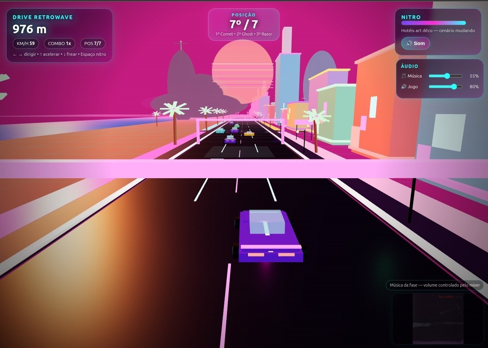

# 🏎️ Retrowave Racer

Um jogo de corrida **3D em HTML, CSS e JavaScript**, inspirado na
estética **Retrowave / Synthwave**.



------------------------------------------------------------------------

# ✨ Destaques

-   🌴 Dois mapas:
    -   Miami Ocean Drive
    -   Rio de Janeiro
-   🚗 Seleção de carro
-   🌅 Ciclo visual com cenário infinito
-   🎵 Música por fase

------------------------------------------------------------------------

# 🛠️ Tecnologias

-   HTML5
-   CSS3
-   JavaScript (ES Modules)
-   Three.js
-   Web Audio API

Sem engines.

------------------------------------------------------------------------

# 📂 Estrutura

``` text
src/
├── main.js
├── Game.js
├── audio/
├── config/
├── core/
├── race/
├── styles/
├── ui/
├── utils/
└── world/
```

------------------------------------------------------------------------

# 🎮 Mecânicas

-   Escolha de carro
-   Escolha de mapa
-   Ranking em tempo real
-   Rivais com IA
-   Tráfego separado da corrida
-   Colisão
-   Efeito de velocidade
-   Mundo infinito

------------------------------------------------------------------------

# 🚀 Como executar

``` bash
npm install
```

``` bash
npm run dev
```

Depois abra:

``` text
http://localhost:5173
```

------------------------------------------------------------------------

Desenvolvido como um projeto experimental para explorar renderização 3D,
arquitetura modular em JavaScript e mecânicas clássicas de jogos de
corrida arcade.
